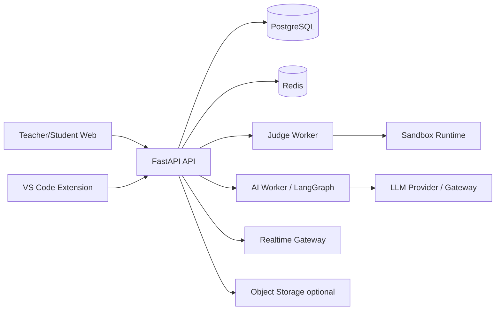

# DEPLOYMENT & OPERATIONS

**Dự án:** CodeMentor AI  
**Mục tiêu:** mô tả cách triển khai MVP 1.0 ổn định cho pilot.

---

## 1. Service topology



Services:

- `web`: teacher/student/admin web.
- `api`: auth, business API, RBAC.
- `ai-worker`: LangGraph workflows.
- `judge-worker`: code execution queue.
- `realtime-gateway`: WebSocket/SSE channel for VS Code live exam/challenge notifications.
- `postgres`: relational data.
- `redis`: queue/cache/session ephemeral data.
- `sandbox-runtime`: Docker/firecracker worker host.

---

## 2. Environments

| Environment | Mục đích | Dữ liệu |
| :--- | :--- | :--- |
| local | Developer | seed data fake |
| staging | QA/demo | anonymized/fake |
| pilot | lớp học thật giới hạn | real data, stricter access |
| production | mở rộng | real data |

---

## 3. Configuration

Required env:

```text
DATABASE_URL=
REDIS_URL=
JWT_SECRET=
ACCESS_TOKEN_TTL_MINUTES=
REFRESH_TOKEN_TTL_DAYS=
LLM_PROVIDER=
LLM_API_KEY=
AI_MODEL_DEFAULT=
JUDGE_QUEUE_NAME=
REALTIME_CHANNEL_BACKEND=
SANDBOX_NETWORK_DISABLED=true
AUDIT_LOG_RETENTION_DAYS=180
```

Never commit:

- LLM API keys.
- JWT secrets.
- Database credentials.
- Production hidden test payloads.

---

## 4. CI/CD pipeline

Stages:

1. Lint.
2. Unit tests.
3. Type checks.
4. Build web.
5. Build extension package.
6. Backend integration tests.
7. AI guardrail regression.
8. Build Docker images.
9. Run migrations in staging.
10. Smoke test.
11. Manual approval for pilot/prod deploy.

---

## 5. Database migrations

Rules:

- Every schema change has migration.
- Migrations are forward-only for pilot.
- Backfill scripts are separate from schema migrations.
- Migrations must run on empty DB and existing staging DB.
- Large data changes require maintenance window.

---

## 6. Observability

### Logs

Every request includes:

- `trace_id`
- `user_id` if authenticated
- `role`
- `endpoint`
- `latency_ms`
- `status_code`

AI logs:

- workflow
- model
- token usage
- policy flags
- latency

Judge logs:

- submission_id
- sandbox result
- runtime
- memory
- timeout

### Metrics

- API latency p50/p95.
- Submission judge latency.
- AI first token latency.
- AI error rate.
- Guardrail violation rate.
- Queue depth.
- DB connection usage.
- Sandbox timeout count.

### Alerts

- Judge queue stuck.
- Realtime gateway disconnected for active assessment sessions.
- AI error rate high.
- DB unavailable.
- Guardrail critical violation.
- Unauthorized access spike.

---

## 7. Backup and recovery

- Daily PostgreSQL backup for pilot/prod.
- Point-in-time recovery if available.
- Backup restore test before pilot.
- Object storage backup if used.
- Secrets rotation plan.

RPO/RTO MVP:

| Metric | Target |
| :--- | :--- |
| RPO | 24 hours |
| RTO | 4 hours |

---

## 8. Deployment checklist

- Env vars configured.
- Database migrated.
- Admin account created.
- Seed demo class optional.
- LLM provider reachable.
- Judge sandbox smoke test pass.
- Realtime notification smoke test pass for VS Code Extension.
- AI guardrail regression pass.
- Web health check pass.
- Extension points to correct API base URL.
- Monitoring dashboard active.
- Rollback image available.
