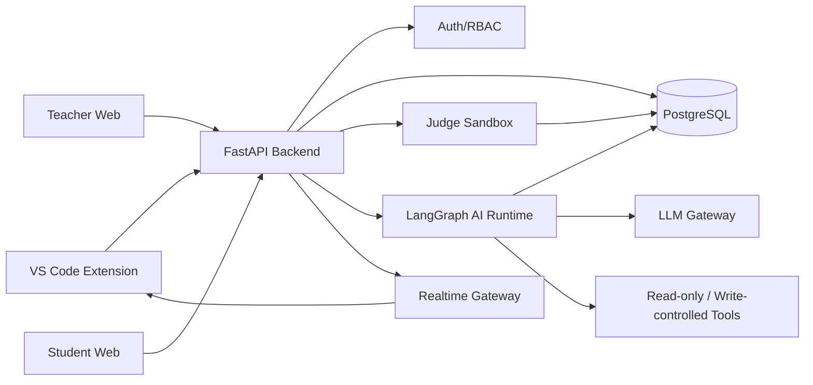
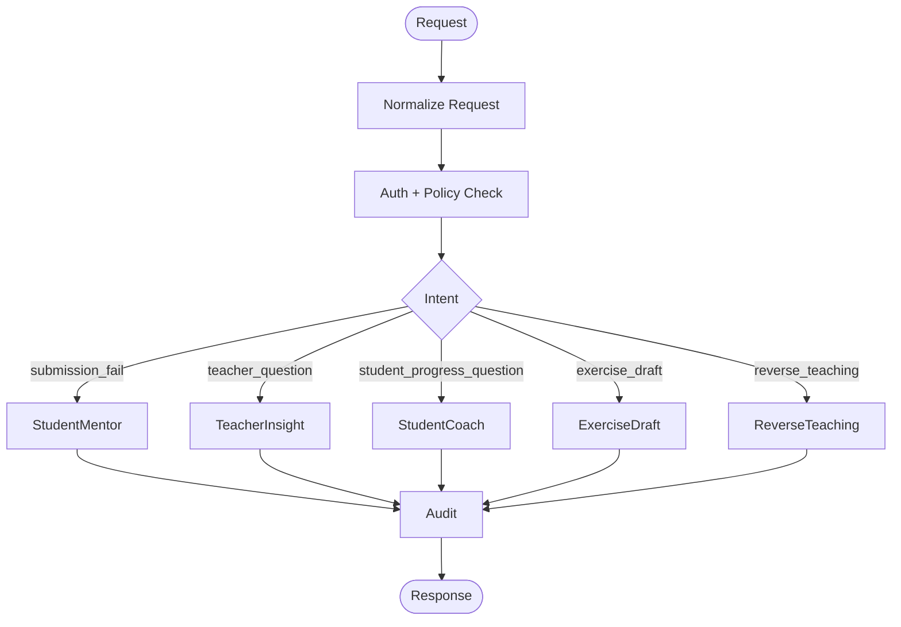
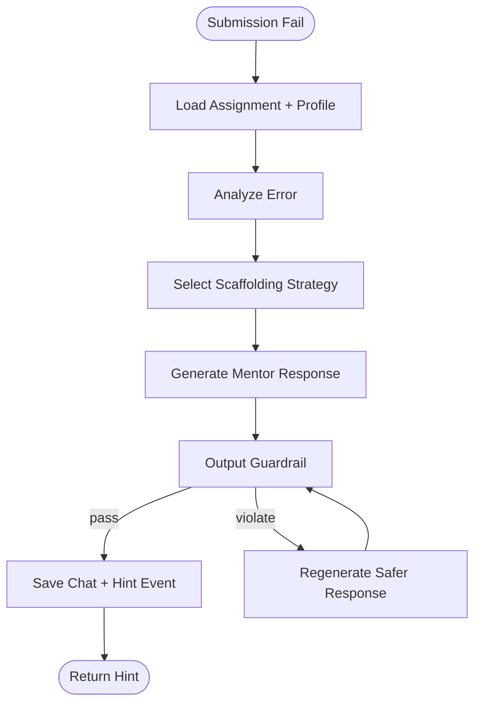
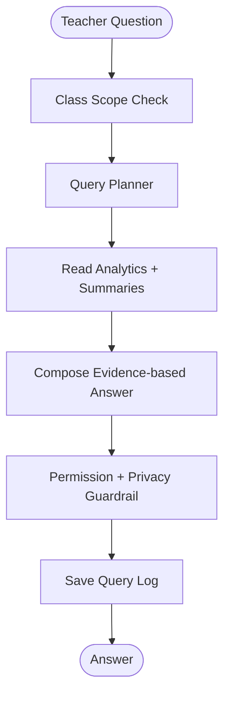
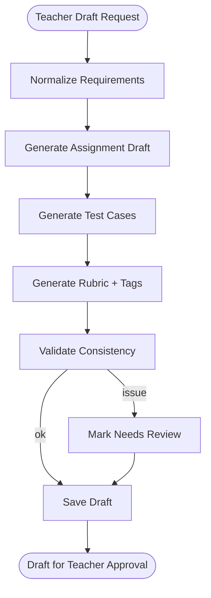
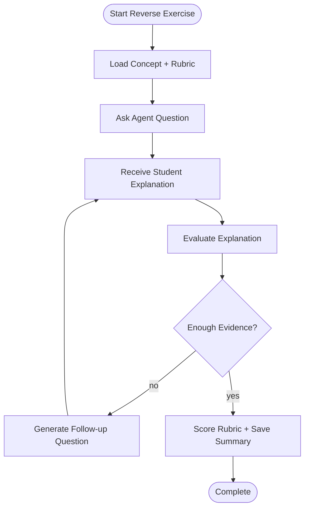

# TÀI LIỆU KỸ THUẬT & KIẾN TRÚC HỆ THỐNG

**Dự án:** CodeMentor AI  
**Phiên bản:** 1.1.0  
**Mục tiêu kiến trúc:** đủ đơn giản cho MVP, vẫn mở rộng được cho chatbot web, bài tập đảo ngược và phân tích học tập.

---

## 1. Nguyên tắc kiến trúc

1. **Tách rõ product surface và AI runtime:** VS Code, web giảng viên, web sinh viên dùng chung backend và AI orchestration.
2. **Không dùng multi-agent phức tạp cho MVP:** thay vì nhiều agent tự trị, hệ thống dùng một LangGraph có state rõ ràng, node nhỏ, route theo intent.
3. **LLM không được là nguồn sự thật duy nhất:** mọi câu trả lời về lớp/sinh viên phải dựa trên database, analytics snapshot hoặc learning summary.
4. **AI tạo draft, con người approve:** đặc biệt với bài tập, test case, rubric.
5. **Audit được:** mọi tương tác AI quan trọng phải lưu input summary, output, policy result, user_id, class_id và trace_id.
6. **Bảo mật code execution:** mọi submission chạy trong sandbox cô lập.

---

## 2. Tổng quan hệ thống



### Thành phần chính

| Thành phần | Vai trò | Ghi chú |
| :--- | :--- | :--- |
| VS Code Extension | Sinh viên làm/nộp bài và chat khi fail. | TypeScript, WebView, Sidebar. |
| Teacher Web | Quản lý lớp, bài tập, dashboard, chatbot giảng viên. | React/Next.js hoặc framework tương đương. |
| Student Web | Dashboard cá nhân, chatbot điều hướng học tập. | Tách quyền dữ liệu nghiêm ngặt. |
| FastAPI Backend | API, RBAC, business logic, orchestrate Judge/AI. | Không nhúng logic prompt trực tiếp trong controller. |
| Judge Sandbox | Chạy code, test case, thu log. | Docker/firecracker tùy mức bảo mật. |
| LangGraph AI Runtime | Mentor, analytics QA, exercise drafting, reverse teaching. | Graph đơn giản, typed state. |
| Assessment Runtime | Quản lý Exam Mode, Quick Challenge, countdown, chatbot quota, integrity events. | Dùng chung assignment, session và policy. |
| Realtime Gateway | Đẩy Exam/Quick Challenge events tới VS Code Extension. | WebSocket/SSE, có fallback polling. |
| PostgreSQL | Dữ liệu sản phẩm, analytics, memory, audit. | JSONB cho AI metadata. |
| LLM Gateway | Chuẩn hóa gọi model, rate limit, retry, logging. | Có thể gọi hosted LLM hoặc model fine-tune nội bộ. |

---

## 3. Thiết kế LangGraph mới

### 3.1. Vì sao không nên dùng multi-agent nặng

Tài liệu cũ mô tả hệ thống như multi-agent stateful. Với quy mô MVP, cách này dễ tạo ra các vấn đề:

- Nhiều agent khó debug và khó audit.
- Chi phí LLM cao do agent gọi qua lại.
- Rủi ro hành vi không ổn định khi agent tự quyết định quá nhiều.
- Tính năng hiện tại chủ yếu là workflow có state, không cần agent tự trị.

Thiết kế mới: **Single Orchestrated Graph + Specialized Routes**. Hệ thống vẫn có nhiều năng lực AI, nhưng không coi mỗi năng lực là một agent độc lập. Mỗi workflow là một route trong cùng runtime, dùng node xác định và tool được kiểm soát.

### 3.2. Các workflow AI

| Workflow | Người dùng | Mục tiêu | Có ghi dữ liệu không |
| :--- | :--- | :--- | :--- |
| `StudentMentorGraph` | Sinh viên VS Code | Gợi ý debug sau submission fail. | Có, chat và learning events. |
| `TeacherInsightGraph` | Giảng viên web | Hỏi đáp về lớp/sinh viên/bài tập. | Có, query log; đọc analytics. |
| `StudentCoachGraph` | Sinh viên web | Theo dõi tiến độ và điều hướng bài tập. | Có, chat; không sửa điểm. |
| `ExerciseDraftGraph` | Giảng viên web | Tạo bài tập nháp/test/rubric/hint. | Có, tạo draft chờ approve. |
| `ReverseTeachingGraph` | Sinh viên web/VS Code | Agent hỏi ngược, sinh viên giảng giải. | Có, rubric score và summary. |

Exam Mode và Quick Challenge không cần một agent AI riêng. Hai chế độ này dùng **Assessment Runtime** để áp policy vào submission, chatbot quota và integrity events. Khi chatbot được phép hoạt động, request vẫn đi qua `StudentMentorGraph` nhưng bị giới hạn bởi `assessment_policy`.

### 3.3. Graph router



Router là lớp backend trước LangGraph hoặc node đầu tiên trong graph. Router chỉ chọn workflow; không để LLM tự ý gọi workflow ghi dữ liệu nếu user không có quyền.

---

## 4. State chuẩn

### 4.1. `BaseAIState`

```python
class BaseAIState(TypedDict):
    trace_id: str
    user_id: str
    role: Literal["student", "teacher", "ta", "admin"]
    class_id: str | None
    assignment_id: str | None
    thread_id: str
    messages: Annotated[list[AnyMessage], add_messages]
    intent: str
    policy_flags: dict
    response: dict | None
```

### 4.2. `StudentMentorState`

```python
class StudentMentorState(BaseAIState):
    submission_id: str
    session_id: str | None
    code_context: str
    error_log: str
    failed_tests: list[dict]
    assignment_metadata: dict
    student_profile: dict
    prior_hints: list[dict]
    scaffolding_level: int
    assessment_policy: dict | None
    root_cause: dict | None
```

### 4.3. `TeacherInsightState`

```python
class TeacherInsightState(BaseAIState):
    question: str
    allowed_scope: dict
    retrieved_metrics: dict
    retrieved_students: list[dict]
    evidence: list[dict]
    answer_confidence: Literal["high", "medium", "low"]
```

### 4.4. `ExerciseDraftState`

```python
class ExerciseDraftState(BaseAIState):
    teacher_prompt: str
    target_tags: list[str]
    difficulty: str
    draft: dict | None
    validation_report: dict | None
    approval_status: Literal["draft", "needs_review", "approved", "rejected"]
```

### 4.5. `ReverseTeachingState`

```python
class ReverseTeachingState(BaseAIState):
    reverse_session_id: str
    concept_tags: list[str]
    agent_misconception: str | None
    student_explanation: str | None
    rubric_scores: dict | None
    follow_up_question: str | None
```

---

## 5. StudentMentorGraph



### Nodes

| Node | Loại | Nhiệm vụ |
| :--- | :--- | :--- |
| `load_context` | deterministic/tool | Lấy assignment, test result, student profile, prior hints. |
| `analyze_error` | LLM structured | Tìm root cause, loại lỗi, concept tag. Không trả trực tiếp cho sinh viên. |
| `select_strategy` | deterministic | Chọn hint level dựa trên fail count, hint budget, profile. |
| `generate_response` | LLM | Sinh câu hỏi/gợi ý theo policy. |
| `output_guardrail` | deterministic + optional LLM | Kiểm tra lộ code, quá dài, đưa đáp án, vi phạm tone. |
| `persist_event` | deterministic/tool | Lưu chat, hint, learning event. |

### Scaffolding policy

| Level | Điều kiện | Kiểu phản hồi |
| :--- | :--- | :--- |
| 1 | Fail lần đầu, sinh viên có independence cao. | Câu hỏi định vị lỗi. |
| 2 | Fail 2-3 lần hoặc lỗi cùng tag lặp lại. | Câu hỏi khái niệm và yêu cầu dự đoán output. |
| 3 | Fail nhiều lần, frustration tăng. | Ví dụ tương tự, không cùng bài. |
| 4 | Gần hết hint budget. | Hướng dẫn checklist debug, vẫn không đưa code giải. |
| 5 | Hết budget hoặc rủi ro phụ thuộc AI. | Tạm dừng, gợi ý tài liệu/slide, yêu cầu thử lại. |

---

## 6. TeacherInsightGraph



### Câu hỏi hỗ trợ

- "Lớp INT101 tuần này đang yếu kỹ năng nào?"
- "Sinh viên Nguyễn A có tiến bộ không?"
- "Bài tập nào dùng nhiều hint nhất?"
- "Nhóm sinh viên nào nên được trợ giảng hỗ trợ?"
- "Hãy đề xuất 3 bài ôn tập về vòng lặp cho buổi sau."

### Nguyên tắc trả lời

- Luôn nêu phạm vi dữ liệu: lớp, thời gian, số lượng submission.
- Phân biệt dữ kiện và suy luận.
- Không hiển thị nội dung code nhạy cảm nếu không cần.
- Với nhận xét cá nhân, dùng ngôn ngữ hỗ trợ học tập, không gán nhãn tiêu cực.

---

## 7. StudentCoachGraph

StudentCoachGraph dùng cho web sinh viên. Graph này chỉ đọc dữ liệu của chính sinh viên đang đăng nhập.

### Năng lực

- Tóm tắt tiến độ học tập.
- Giải thích mastery map bằng ngôn ngữ dễ hiểu.
- Gợi ý bài tập tiếp theo.
- Điều hướng đến bài tập hoặc reflection history.
- Nhắc deadline.

### Ràng buộc

- Không tiết lộ test case ẩn.
- Không đưa lời giải bài đang mở.
- Không so sánh sinh viên với bạn học khác theo cách gây áp lực.
- Không cho phép xem dữ liệu lớp tổng hợp nếu quyền chỉ là sinh viên.

---

## 8. ExerciseDraftGraph



AI chỉ tạo `exercise_drafts`. Bài tập thật trong `assignments` chỉ được tạo sau khi giảng viên approve. Hệ thống cần lưu validation report để giảng viên biết test case nào cần xem kỹ.

---

## 9. ReverseTeachingGraph



Reverse Teaching không chỉ kiểm tra output mà kiểm tra khả năng giải thích. Điểm nên gồm:

- Đúng khái niệm.
- Có khả năng phát hiện hiểu lầm của agent.
- Có nêu edge case.
- Có diễn giải từng bước.
- Không chỉ nói kết luận.

---

## 10. Data flow chính

### 10.1. Submission fail

1. Extension gọi `POST /submissions`.
2. Backend lưu submission ở trạng thái `pending`.
3. Judge chạy code và cập nhật result.
4. Nếu fail, backend tạo/tiếp tục `chat_thread`.
5. Backend gọi `StudentMentorGraph`.
6. Graph lưu hint event và trả phản hồi.
7. Extension hiển thị chat.

### 10.2. Giảng viên hỏi chatbot

1. Web gọi `POST /ai/teacher/chat`.
2. Backend kiểm tra `teacher_id` có quyền với `class_id`.
3. Graph tạo query plan chỉ đọc dữ liệu cho phép.
4. Graph sinh câu trả lời có evidence.
5. Backend lưu `teacher_ai_queries`.

### 10.3. Sinh viên hỏi chatbot web

1. Web gọi `POST /ai/student/chat`.
2. Backend giới hạn scope theo `user_id`.
3. Graph đọc profile, submissions, assignments.
4. Graph trả lời và có thể kèm navigation action.

### 10.4. Exam Mode

1. Giảng viên tạo `assessment_session` với `session_type = exam`.
2. Backend validate assignment, time window, `assessment_policy`.
3. Sinh viên mở VS Code Extension và nhận session đang mở.
4. Extension hiển thị exam banner, countdown, chatbot quota và integrity notice.
5. Khi sinh viên paste/mất focus/window blur, extension gửi `integrity_event`.
6. Khi sinh viên hỏi chatbot, backend kiểm tra quota và `max_scaffolding_level` trước khi gọi `StudentMentorGraph`.
7. Submission gắn `session_id`, judge chấm như bình thường.
8. Teacher dashboard hiển thị result + integrity summary.

### 10.5. Quick Challenge

1. Giảng viên tạo hoặc chọn assignment ngắn.
2. Giảng viên launch `assessment_session` với `session_type = quick_challenge`.
3. Backend chuyển session sang `live` và publish realtime event cho sinh viên trong lớp.
4. VS Code Extension hiển thị alert, countdown và nút mở bài.
5. Sinh viên submit; backend cập nhật participant status và leaderboard.
6. Khi session kết thúc, backend finalize rank và bonus points.

---

## 11. API layer

API chi tiết nằm trong `api_contracts.md`. Về kiến trúc, API được chia thành các nhóm:

- `/auth/*`: đăng nhập, refresh token, role.
- `/classes/*`: lớp học và thành viên.
- `/assignments/*`: bài tập, test case, publish.
- `/submissions/*`: nộp bài, kết quả judge.
- `/assessment-sessions/*`: Exam Mode, Quick Challenge, integrity events, leaderboard.
- `/ai/student/*`: mentor và coach cho sinh viên.
- `/ai/teacher/*`: chatbot giảng viên và exercise drafting.
- `/analytics/*`: dashboard, snapshots.
- `/admin/*`: cấu hình model, policy, audit.

---

## 12. Memory và analytics

### 12.1. Short-term memory

- Lưu trong LangGraph checkpoint và bảng `chat_threads`.
- Scope theo `thread_id`.
- Với VS Code mentor, format khuyến nghị: `mentor:{student_id}:{assignment_id}`.
- Với reverse teaching: `reverse:{student_id}:{assignment_id}:{session_id}`.

### 12.2. Long-term memory

- Lưu trong `user_ai_profiles`.
- Cập nhật từ learning events, submissions, reverse teaching rubric.
- Không để LLM tự ghi trực tiếp profile. LLM đề xuất update, backend kiểm tra và áp dụng rule.

### 12.3. Analytics snapshot

- Dashboard và chatbot giảng viên nên đọc snapshot đã tính sẵn khi có thể.
- Tránh để mỗi câu hỏi chatbot truy vấn thô toàn bộ submission.
- Snapshot có thể được refresh theo lớp, bài tập, ngày.

---

## 13. Bảo mật

| Rủi ro | Biện pháp |
| :--- | :--- |
| Code độc hại | Sandbox, giới hạn CPU/RAM/time, network disabled. |
| Prompt injection từ code/comment | Tách code thành dữ liệu, không để code override system prompt. |
| Lộ lời giải | Output guardrail, hint policy, audit sampling. |
| Exam/Challenge integrity vượt quá khả năng extension | Proctoring-lite, ghi nhận tín hiệu thay vì hứa khóa tuyệt đối OS/browser. |
| Lạm dụng chatbot trong kiểm tra | Assessment policy, per-session quota, max scaffolding level, audit. |
| Lộ dữ liệu sinh viên | RBAC, row-level scope, privacy guardrail. |
| AI tạo test sai | Draft validation, teacher approval bắt buộc. |
| Chi phí LLM cao | Cache analysis, snapshot analytics, model routing. |

---

## 14. Khuyến nghị triển khai MVP

MVP nên triển khai theo thứ tự:

1. Auth, class, assignment, submission, judge.
2. VS Code extension với submission và mentor chat.
3. Database learning events và profile cơ bản.
4. Teacher dashboard cơ bản.
5. Teacher chatbot đọc analytics snapshot.
6. Student web dashboard và chatbot điều hướng.
7. Exercise drafting có approval.
8. Reverse Teaching Exercise.
9. Exam Mode và Quick Challenge chạy trên Assessment Runtime.

Thiết kế này giữ LangGraph đủ mạnh để mở rộng nhưng không biến hệ thống thành một mạng multi-agent khó kiểm soát.
