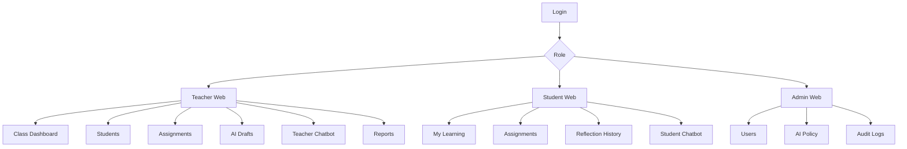

# UI/UX SPECIFICATION

**Dự án:** CodeMentor AI  
**Phạm vi:** Teacher Web, Student Web, Admin Web, VS Code Extension  
**Mục tiêu thiết kế:** rõ ràng, đáng tin, giàu dữ liệu, không giống landing page. Đây là sản phẩm học tập và vận hành lớp học, nên UI ưu tiên scan nhanh, action rõ, thông tin có ngữ cảnh.

---

## 1. Nguyên tắc thiết kế

- **Dashboard-first:** màn hình đầu tiên sau đăng nhập là nơi làm việc, không phải trang marketing.
- **Data with action:** mọi insight quan trọng phải có hành động tiếp theo: mở bài, xem sinh viên, tạo bài ôn, gửi nhắc nhở.
- **AI có kiểm soát:** chatbot luôn hiển thị phạm vi dữ liệu và evidence khi trả lời phân tích.
- **Không làm sinh viên xấu hổ:** student UI dùng ngôn ngữ hỗ trợ, tránh xếp hạng gây áp lực.
- **Dense but calm:** giảng viên cần quét nhiều dữ liệu, layout phải gọn, nhiều bảng/biểu đồ nhưng không rối.
- **IDE-native:** VS Code extension phải giống một tool panel trong IDE, không giống web app nhúng nặng.

---

## 2. Information architecture



---

## 3. Design system

### 3.1. Layout tokens

| Token | Giá trị |
| :--- | :--- |
| Page max width | 1440px |
| Content gutter | 24px desktop, 16px tablet/mobile |
| Sidebar width | 248px |
| Right inspector width | 360px |
| Card radius | 8px |
| Table row height | 44px compact, 56px comfortable |
| Toolbar height | 48px |

### 3.2. Color roles

Không dùng palette một màu. Gợi ý role:

| Role | Mục đích |
| :--- | :--- |
| Neutral | Nền, text, border, table. |
| Blue | Link, selected state, primary action. |
| Green | Passed, improved, approved. |
| Amber | Warning, needs review, deadline soon. |
| Red | Failed, overdue, policy violation. |
| Teal | Learning insight, mastery highlight. |

### 3.3. Component set

- Sidebar navigation.
- Top command bar.
- Data table với filter/sort/search.
- Metric tile.
- Trend sparkline.
- Mastery radar/bar chart.
- Chat panel.
- Evidence drawer.
- Assignment editor.
- Test case editor.
- Rubric editor.
- Approval banner.
- Empty state.
- Error state.
- Loading skeleton.
- Toast.

---

## 4. Teacher Web

### 4.1. Teacher layout

Desktop:

```text
+--------------------------------------------------------------+
| Top Bar: Class Switcher | Search | Notifications | Profile   |
+----------+---------------------------------------------------+
| Sidebar  | Page Header + Actions                             |
|          | Metrics Row                                       |
|          | Main Content Table/Charts        | AI Chat Panel  |
|          | Detail Drawer / Evidence         | optional       |
+----------+---------------------------------------------------+
```

Sidebar items:

- Overview
- Students
- Assignments
- AI Drafts
- Reverse Teaching
- Reports
- Settings

### 4.2. Class Overview Dashboard

Mục tiêu: giảng viên biết ngay lớp đang ổn hay cần can thiệp.

Sections:

1. **Header**
   - Class name.
   - Term.
   - Date range selector.
   - Button: `Create Assignment`.
   - Button: `Ask AI`.

2. **Metric tiles**
   - Completion Rate.
   - Average Attempts.
   - Hint Density.
   - At-risk Students.
   - Top Weak Tag.

3. **Knowledge Gap Chart**
   - Bar chart theo `knowledge_tags`.
   - Click tag lọc assignments/students liên quan.

4. **Assignments Health Table**
   - Columns: Assignment, Type, Due, Completion, Avg Attempts, Hint Density, Top Error, Actions.
   - Actions: View Detail, Create Review Exercise, Ask AI about this.

5. **At-risk Students Panel**
   - List sinh viên có nhiều fail, overdue, frustration signals.
   - Không dùng nhãn tiêu cực; dùng "Need support".

6. **Teacher AI Chat Panel**
   - Dock bên phải.
   - Có suggested prompts:
     - "Lớp đang yếu phần nào?"
     - "Ai cần hỗ trợ trước buổi tới?"
     - "Tạo bài ôn về tag yếu nhất."

States:

- Empty: chưa có submission, hướng dẫn publish assignment đầu tiên.
- Loading: skeleton cho metric/charts.
- Error: retry và trace_id.

### 4.3. Student Detail Dashboard

Mục tiêu: hiểu tình trạng một sinh viên mà không phải đọc toàn bộ chat/code.

Sections:

- Student header: name, email, class role, latest activity.
- Progress strip: completed, in progress, overdue.
- Mastery Map: bar/radar theo tags.
- Independence Score trend.
- Common Pitfalls table.
- Recent Submissions timeline.
- AI Interaction Summary.
- Reverse Teaching results.
- Recommended Intervention.

Primary actions:

- Ask AI about this student.
- Assign practice.
- Add private note.
- Open transcript.

Privacy:

- Source code collapsed by default.
- Chat transcript requires explicit click.
- Sensitive fields masked in projected classroom mode.

### 4.4. Assignments Page

Views:

- List view.
- Board by status: Draft, Published, Closed.
- Detail/editor.

Assignment list columns:

- Title.
- Type.
- Difficulty.
- Tags.
- Deadline.
- Published status.
- Completion.
- Actions.

Assignment detail tabs:

- Overview.
- Test Cases.
- Submissions.
- Insights.
- AI Hints.
- Reverse Teaching Rubric if type is reverse.

### 4.5. Exercise Builder

Layout:

```text
+---------------------------------------------------+
| Assignment Settings                               |
+----------------------+----------------------------+
| Problem Statement    | Preview                    |
| Test Cases           | Validation                 |
| Rubric               | Hint Policy                |
+----------------------+----------------------------+
| Save Draft | Publish | Generate with AI           |
+---------------------------------------------------+
```

Fields:

- Title.
- Type: Coding / Reverse Teaching.
- Difficulty.
- Tags.
- Description markdown.
- Language policy.
- Visible tests.
- Hidden tests.
- Rubric.
- Hint policy.
- Deadline.

Validation:

- Missing expected output.
- Duplicate test.
- Hidden tests missing.
- Rubric total mismatch.
- Hint policy too permissive.

### 4.6. AI Draft Review

Mục tiêu: AI giúp nhanh hơn nhưng giảng viên vẫn kiểm soát.

Screen:

- Left: AI generated draft.
- Right: Validation report + approval checklist.
- Bottom: version history.

Approval checklist:

- Statement clear.
- Visible tests pass.
- Hidden tests reviewed.
- Tags correct.
- Rubric correct.
- Hint policy safe.

Actions:

- Edit.
- Regenerate section.
- Approve as Draft.
- Approve and Publish.
- Reject.

### 4.7. Teacher Chatbot UI

Chat panel components:

- Scope selector: class, assignment, student.
- Prompt input.
- Suggested prompts.
- Answer block.
- Evidence chips.
- Recommended actions.
- Follow-up questions.

Answer format:

```text
Answer
Evidence used: 7 days, 96 submissions, class INT101
Recommended actions
Evidence drawer
```

Evidence drawer:

- Metrics.
- Assignment refs.
- Student group refs.
- Snapshot timestamp.

---

## 5. Student Web

### 5.1. Student layout

Desktop/tablet:

```text
+------------------------------------------------------+
| Top Bar: Class Switcher | Ask AI | Profile           |
+----------+-------------------------------------------+
| Sidebar  | My Learning Dashboard                     |
|          | Assignments + Mastery + Chat              |
+----------+-------------------------------------------+
```

Mobile:

- Bottom nav: Home, Assignments, Ask AI, Profile.
- Charts chuyển thành compact cards.

### 5.2. My Learning Dashboard

Sections:

1. **Today Panel**
   - Bài cần làm.
   - Deadline gần nhất.
   - Continue button.

2. **Progress Overview**
   - Completed / In Progress / Overdue.
   - Current streak optional.

3. **Mastery Map**
   - Tags with score and trend.
   - Tooltip giải thích score.

4. **Common Pitfalls**
   - "Bạn hay gặp" thay vì "Bạn yếu".
   - Mỗi pitfall có checklist tự kiểm tra.

5. **Recommended Next**
   - 3 bài nên làm tiếp.
   - Lý do đề xuất.

6. **Reflection History**
   - Lỗi đã sửa.
   - Bài học rút ra.

### 5.3. Student Chatbot

Mục tiêu: giúp sinh viên tự định hướng học.

UI:

- Chat input có placeholder: "Hỏi về tiến độ học tập của bạn..."
- Suggested prompts:
  - "Mình nên làm bài nào tiếp?"
  - "Mình hay sai lỗi gì?"
  - "Giải thích mastery map của mình."
  - "Đưa mình đến bài đang quá hạn."

Response:

- Summary.
- Action cards.
- Navigation button.
- Không đưa lời giải bài chưa hoàn thành.

### 5.4. Assignment Detail

Sections:

- Problem statement.
- Visible examples.
- Status.
- Attempts.
- Hints used.
- Open in VS Code button.
- Reflection after pass.

For Reverse Teaching:

- Scenario.
- Expected skills.
- Start session button.
- Rubric progress.
- Transcript after completion.

---

## 6. VS Code Extension

### 6.1. Extension surfaces

- Activity Bar icon: CodeMentor.
- Sidebar Tree View: Classes and Assignments.
- WebView Panel: Assignment detail and Mentor chat.
- Status Bar item: selected assignment and submission status.
- Command Palette commands.

Commands:

- `CodeMentor: Login`
- `CodeMentor: Select Class`
- `CodeMentor: Open Assignment`
- `CodeMentor: Submit Current File`
- `CodeMentor: Ask Mentor`
- `CodeMentor: Open Dashboard`

### 6.2. Sidebar structure

```text
CodeMentor
  Class: Python 101
    Due Soon
      [!] Tổng số chẵn
    In Progress
      [~] Mảng một chiều
    Completed
      [✓] Tính giai thừa
```

Each assignment item shows:

- Title.
- Status icon.
- Deadline badge.
- Hint count if relevant.

### 6.3. Assignment WebView

Tabs:

- Description.
- Submissions.
- Mentor.
- Reflection.

Description tab:

- Problem markdown.
- Visible tests.
- Tags.
- Submit button.

Submissions tab:

- Attempt timeline.
- Status badges.
- Failed public feedback.

Mentor tab:

- Chat transcript.
- Hint budget indicator.
- Current scaffolding level as subtle label.
- Input disabled when no failed submission or budget exhausted.

Reflection tab:

- Prompt after pass.
- Save reflection.

### 6.4. Submit flow

1. User selects assignment.
2. User clicks submit or command palette.
3. Extension validates file/language.
4. Status bar shows `Submitting...`.
5. API returns result.
6. If accepted: show success and reflection prompt.
7. If failed: open Mentor tab with AI first hint.

States:

- Not logged in.
- No class selected.
- No assignment selected.
- File language mismatch.
- Submitting.
- Judge pending.
- Accepted.
- Failed with mentor available.
- Failed with mentor unavailable due to policy.

### 6.5. VS Code UX rules

- Không tự động sửa code.
- Không pop-up modal gây gián đoạn khi sinh viên đang gõ, trừ submission result.
- Mentor panel mở cạnh editor, không che file.
- Tất cả long-running actions có cancel/retry.
- Error messages có trace_id khi lỗi backend.

---

## 7. Admin Web

Admin screens:

- Users.
- Classes.
- AI Policy.
- Model Config.
- Audit Logs.
- System Health.

Audit table columns:

- Time.
- Workflow.
- User.
- Class.
- Model.
- Policy flags.
- Latency.
- Trace ID.

AI Policy screen:

- Hint budget default.
- No-code leakage threshold.
- Enabled workflows.
- Model routing.
- Retention settings.

---

## 8. Responsive behavior

| View | Desktop | Tablet | Mobile |
| :--- | :--- | :--- | :--- |
| Teacher Dashboard | Sidebar + charts + chat panel | Sidebar collapses | Read-only compact; heavy editing discouraged |
| Student Dashboard | Full dashboard | Compact charts | Bottom nav, cards stacked |
| Exercise Builder | Two-column editor | Single-column with sticky actions | Not primary; show limited editing |
| VS Code Extension | Native VS Code panels | Same | Not applicable |

---

## 9. Empty, loading, error states

### Empty states

- No class: "Create your first class" / "Join a class".
- No assignment: "Create assignment" for teacher, "No assignments yet" for student.
- No analytics: "Analytics will appear after students submit."
- No chat evidence: "I do not have enough data yet."

### Loading states

- Skeleton metric cards.
- Table row skeleton.
- Chat typing indicator.
- Submit spinner with elapsed time.

### Error states

- User-friendly message.
- Retry button.
- Trace ID.
- Fallback action.

---

## 10. Accessibility

- Keyboard navigable.
- Contrast AA.
- Charts include table alternatives.
- Chat messages readable by screen readers.
- Buttons have clear labels.
- Status not communicated by color alone.

---

## 11. MVP UI acceptance checklist

- Teacher can complete class -> assignment -> dashboard -> chatbot -> AI draft -> approval.
- Student can complete assignment -> mentor -> pass -> dashboard -> chatbot -> reverse teaching.
- Extension works without opening web for normal submit flow.
- All major screens have empty/loading/error states.
- All destructive/publish actions have confirmation.
- AI answers show scope/evidence where relevant.
